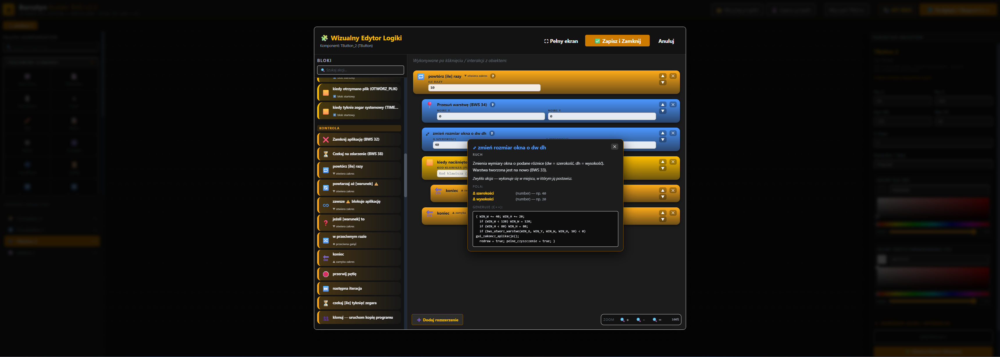
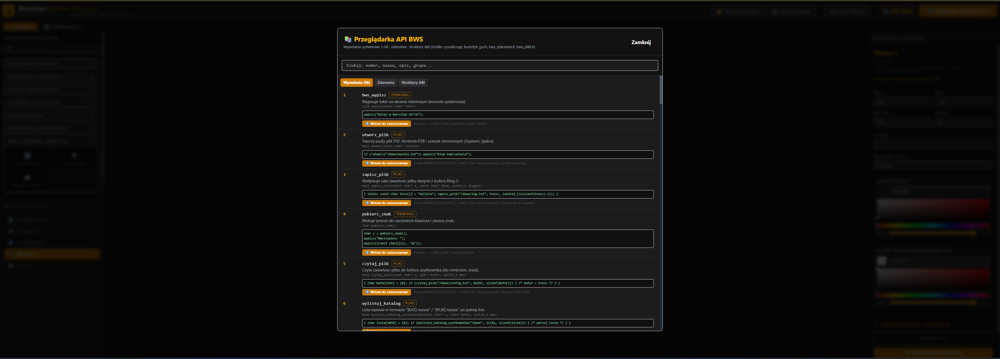
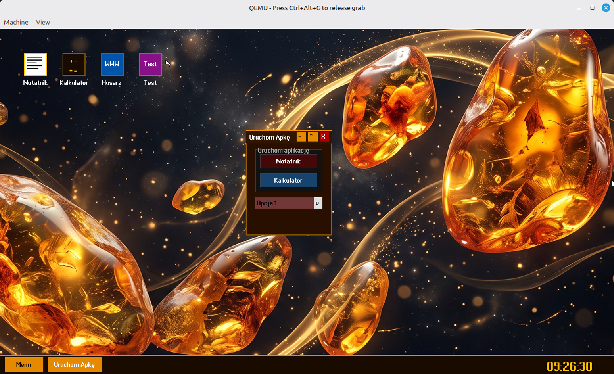

<div align="center">
  

  # 💎 Bursztyn Builder RAD
  **Wizualny konstruktor aplikacji dla Bursztyn OS**

  [](#)
  [](#)
  [](#)
</div>

## 📖 O projekcie
**Bursztyn Builder RAD** to potężne, wizualne środowisko programistyczne (Rapid Application Development) stworzone specjalnie z myślą o systemie **Bursztyn OS**. Narzędzie to pozwala na błyskawiczne projektowanie interfejsów graficznych (GUI) i automatyczne generowanie gotowego, zoptymalizowanego kodu C++.

---

## ✨ Główne Możliwości

### 🎨 Projektowanie Wizualne (Drag & Drop)
Twórz interfejsy w mgnieniu oka, korzystając z intuicyjnego płótna projektowego.
* **Bogata paleta komponentów:** Elementy podzielone na kategorie: *Standardowe, Rozszerzone, Złożone, Systemowe/Multimedia, Dialogi, Bazy Danych*.
* **Pełna swoboda przestrzenna:** Przesuwanie (drag) i bezproblemowa zmiana rozmiaru elementów na płótnie za pomocą 8 wygodnych uchwytów.
* **Szybka nawigacja:** Zaznaczaj komponenty bezpośrednio klikając na płótnie lub wybierając je w czytelnym Drzewie Obiektów.
* **Zarządzanie projektem:** Błyskawiczne zapisywanie i wczytywanie projektów do zoptymalizowanych plików JSON. Możliwość łatwego usuwania komponentów (klawisz Delete lub menu kontekstowe).
* **Podgląd na żywo:** Wbudowany edytor Monaco pozwala na bieżąco podglądać i pobierać wygenerowany kod C++ (`.cpp`).

<div align="center">
  
  <br>
  <em>Przykładowa aplikacja stworzona w konstruktorze dla Bursztyna</em>
</div>
<div align="center">
  
</div>

### 🛠 Zaawansowany Inspektor Obiektów
Miej pełną kontrolę nad każdym detalem i zachowaniem swojej aplikacji.
* **Precyzyjne właściwości:** Szybka edycja nazwy, pozycji (X/Y), rozmiaru (W/H) oraz indeksu Z-Order.
* **Stylizacja:** Wbudowany picker kolorów dla tła i tekstu, w pełni zgodny z systemowym formatem `0xAARRGGBB`.
* **Zarządzanie treścią:** 
  * Łatwa edycja tekstów dla etykiet i przycisków.
  * Obsługa zaawansowanych list (ComboBox, ListBox, CheckListBox, RadioGroup, MainMenu) – edycja pozycji realizowana prosto, po jednej linii.
* **Interaktywne Zdarzenia (Click/Interakcja):** Obsługa zdarzeń dla szerokiej gamy kontrolek (w tym Przyciski, CheckBox, ComboBox, TreeView, ListView, TrackBar, DateTimePicker i innych) w dwóch wygodnych trybach:
  1. **Edytor Wizualny (No-Code):** Gotowe bloki akcji takie jak: *wypisz tekst, uruchom program, odtwórz dźwięk, zamknij aplikację, wstaw surowy kod C++*.
  2. **Ręczny Kod:** Pełna swoboda pisania własnych skryptów w C++.

### ⚙️ Niezawodny Generator Kodu C++
Narzędzie dba o to, by wygenerowany kod był od razu gotowy do kompilacji i działania z biblioteką `bursztyn_gui.h`.
* **Bezpieczeństwo i czystość:** Poprawne escapowanie tekstu (cudzysłowy, ukośniki `\`, nowe linie) – całkowicie bezpieczne dla wielolinijkowych kontrolek `Memo`.
* **Standardy C++:** Generowanie unikalnych, poprawnych identyfikatorów zmiennych stanu (wbudowana sanityzacja polskich znaków i spacji w nazwach).
* **Funkcjonalność Out-of-the-Box:** Wygenerowane aplikacje "po prostu działają". Obsługują natywnie:
  * **ComboBox** – rozwijanie/zwijanie listy, wybór pozycji, automatyczne zamykanie po kliknięciu poza.
  * **CheckBox / RadioButton** – płynne przełączanie zaznaczenia (np. „✓”) i stanów.
  * **ListBox / CheckListBox** – podświetlanie i responsywny wybór pozycji.
  * **Memo** – perfekcyjne renderowanie wielolinijkowej treści.
  * **Wizualizacje** – poprawne rysowanie pasków postępu (ProgressBar), pasków statusu (StatusBar), grupowania (GroupBox), Menu (MainMenu) i innych właściwości.
* **Precyzyjny Hit-Test:** Inteligentna obsługa kliknięć idąca od najwyższego elementu w hierarchii w dół, przerwana po pierwszym trafieniu (eliminuje problem „przebijania” przez nakładające się kontrolki).
* **Natywna obsługa okna:** Wygenerowane aplikacje natychmiast posiadają standardową obsługę dla środowiska: przeciąganie za belkę, minimalizacja, maksymalizacja, przywracanie oraz zamykanie.

### Program nie jest idealny posiada błędy w niektórych komponnetach.


## Jak dodać wygenerowany kod do Burstzyna?

### Krok 1: Kompilacja w Makefile
W pliku `Makefile`, dokładnie w tym samym miejscu, w którym kompilujesz Notatnik i Kalkulator, dodaj kompilację nowej aplikacji i zrób z niej "blob" dla Jądra:

```makefile
# Kompilacja aplikacji do czystego pliku binarnego (bez standardowej biblioteki)
x86_64-elf-g++ -c moja_aplikacja.cpp -o moja_aplikacja.o -ffreestanding -fno-exceptions -fno-rtti
x86_64-elf-ld -T skrypt_linkera.ld moja_aplikacja.o -o moja_aplikacja.bin

# Zamiana na obiekt ładowalny do Jądra
x86_64-elf-objcopy -I binary -O elf64-x86-64 -B i386 moja_aplikacja.bin moja_aplikacja_obj.o
(Zwróć uwagę, aby moja_aplikacja_obj.o była dopisana do listy plików linkowanych z jądrem!)
```
## Krok 2: Wgranie aplikacji do Systemu Plików (Jądro)

Teraz musimy powiedzieć Jądru (w pliku kernel.cpp), żeby podczas startu systemu wgrało ten plik binarny na wirtualny dysk jako paczkę .cebula.

```
// ... existing code ...
// Deklaracja symboli Menedżera Okien
extern "C" uint8_t _binary_menedzer_okien_bin_start[];
extern "C" uint8_t _binary_menedzer_okien_bin_end[];

extern "C" char _binary_przegladarka_bin_start[];
extern "C" char _binary_przegladarka_bin_end[];

// DODANE: Nasza nowa aplikacja z Buildera
extern "C" uint8_t _binary_moja_aplikacja_bin_start[];
extern "C" uint8_t _binary_moja_aplikacja_bin_end[];

// Prototyp funkcji uruchamiającej program z uwzględnieniem Systemu Uprawnień PZB
// ... existing code ...
    utworz_katalog("/programy/kalkulator.cebula"); 
    utworz_katalog("/programy/przegladarka.cebula"); 
    utworz_katalog("/programy/moja_apka.cebula"); // DODANE: Folder paczki
    utworz_katalog("/uslugi");
// ... existing code ...
    utworz_plik("/programy/kalkulator.cebula/kalkulator.bur");
    zapisz_do_pliku("/programy/kalkulator.cebula/kalkulator.bur", (const char*)_binary_kalkulator_bin_start, kalkulator_rozmiar);
    wypisz_log("[BSP] Aplikacja Kalkulator zainstalowana jako paczka .cebula!");

    // =========================================================
    // --- WDRAŻANIE NOWEJ APLIKACJI Z BUILDERA ---
    // =========================================================
    const char* manifest_moja_apka = 
        "nazwa = \"Moja Apka\"\n"
        "autor = \"Programista Art\"\n"
        "wersja = \"1.0\"\n"
        "poziom_zaufania = 4\n"
        "plik_startowy = \"moja_apka.bur\"\n"
        "uprawnienia = [\n"
        "    \"okna\"\n"
        "]\n";
        
    int len_manifest_apka = 0;
    while (manifest_moja_apka[len_manifest_apka] != '\0') len_manifest_apka++;

    utworz_plik("/programy/moja_apka.cebula/opis.aplikacji");
    zapisz_do_pliku("/programy/moja_apka.cebula/opis.aplikacji", manifest_moja_apka, len_manifest_apka);

    uint64_t moja_apka_rozmiar = (uint64_t)(_binary_moja_aplikacja_bin_end - _binary_moja_aplikacja_bin_start);
    if(moja_apka_rozmiar < 24576) moja_apka_rozmiar = 24576; 
    
    utworz_plik("/programy/moja_apka.cebula/moja_apka.bur");
    zapisz_do_pliku("/programy/moja_apka.cebula/moja_apka.bur", (const char*)_binary_moja_aplikacja_bin_start, moja_apka_rozmiar);
    wypisz_log("[BSP] Moja Aplikacja zainstalowana jako paczka .cebula!");

    // =========================================================
    // --- WDRAŻANIE MENEDŻERA OKIEN (PULPIT) ---
// ... existing code ...
```

## Krok 3: Dodanie ikony na Pulpicie
Aplikacja jest już bezpiecznie zainstalowana na wirtualnym dysku Bursztyna w izolowanym folderze .cebula. Teraz musisz dodać tylko ikonę na Pulpicie, aby móc w nią kliknąć! Zrobimy to w menedzer_okien.cpp.

```
/*
 * Menedżer Okien (Pulpit i Pasek Zadań) dla Bursztyn OS
 */

#include "bursztyn_gui.h"

struct NaglowekBur {
    uint8_t  magia[4];            
    uint64_t punkt_wejscia;       
    uint64_t tekst_przesuniecie;  
    uint64_t tekst_rozmiar;       
    uint64_t tekst_wirtualny;     
    uint64_t dane_przesuniecie;   
    uint64_t dane_rozmiar;        
    uint64_t dane_wirtualny;      
} __attribute__((packed));

extern "C" __attribute__((noreturn)) void _start();

extern "C" {
    __attribute__((section(".naglowek"), used))
    struct NaglowekBur naglowek = {
        {'B', 'U', 'R', '\0'},
        (uint64_t)&_start,
        4096, 32768, 0x601000,
        36864, 131072, 0x609000
    };
}

int screen_w = 1024, screen_h = 768;
bool menu_start_otwarte = false;
int ostatni_mysz_x = -1, ostatni_mysz_y = -1;
char ostatni_czas[32] = {0};

void RysujPulpit(bool wymus_pelne_odswiezenie) {
    if (wymus_pelne_odswiezenie) gui_odswiez_pulpit();

    gui_rysuj_prostokat(0, screen_h - 40, screen_w, 40, 0x001A0B00); 
    gui_rysuj_prostokat(0, screen_h - 40, screen_w, 2, 0x00E58A00);  

    // Przycisk Menu z wyśrodkowanym tekstem
    gui_rysuj_prostokat(10, screen_h - 35, 80, 30, 0x00E58A00);
    gui_wypisz_tekst_kolor(28, screen_h - 28, 0x001A0B00, "Menu");

    // Przypiete skroty aplikacji na pasku zadan.
    gui_rysuj_prostokat(100, screen_h - 36, 32, 32, 0x00FFBF00);
    gui_wypisz_tekst_kolor(102, screen_h - 28, 0x00000000, "N");
    gui_rysuj_prostokat(140, screen_h - 36, 32, 32, 0x008A5A00);
    gui_wypisz_tekst_kolor(142, screen_h - 28, 0x00FFFFFF, "+-");
    gui_rysuj_prostokat(180, screen_h - 36, 32, 32, 0x000078D7);
    gui_wypisz_tekst_kolor(182, screen_h - 28, 0x00FFFFFF, "W");

    // Ikona Notatnika
    gui_rysuj_prostokat(50, 50, 48, 48, 0x00FFBF00); 
    gui_rysuj_prostokat(52, 52, 44, 44, 0x00FFFFFF); 
    gui_rysuj_prostokat(56, 58, 32, 2, 0x00000000);
    gui_rysuj_prostokat(56, 64, 32, 2, 0x00000000);
    gui_rysuj_prostokat(56, 70, 20, 2, 0x00000000);
    gui_rysuj_prostokat(56, 76, 32, 2, 0x00000000);
    gui_rysuj_prostokat(56, 82, 24, 2, 0x00000000);
    rysuj_tekst_wysrodkowany(50, 104, 48, 16, 1, 0x00FFFFFF, "Notatnik");

    // Ikona Kalkulatora
    // --- NOWE: Ikona Przeglądarki Hussar ---
    gui_rysuj_prostokat(210, 50, 48, 48, 0x000078D7); // Jasnoniebieska ramka
    gui_rysuj_prostokat(212, 52, 44, 44, 0x000055AA); // Ciemnoniebieskie wnętrze
    rysuj_tekst_wysrodkowany(210, 65, 48, 16, 1, 0x00FFFFFF, "WWW");
    rysuj_tekst_wysrodkowany(210, 104, 48, 16, 1, 0x00FFFFFF, "Hussar");

    // --- DODANE: Nasza nowa aplikacja z Buildera ---
    gui_rysuj_prostokat(290, 50, 48, 48, 0x008A5A00); // Ramka
    gui_rysuj_prostokat(292, 52, 44, 44, 0x00E58A00); // Wnętrze pomarańczowe
    rysuj_tekst_wysrodkowany(290, 65, 48, 16, 1, 0x001A0B00, "RAD");
    rysuj_tekst_wysrodkowany(290, 104, 48, 16, 1, 0x00FFFFFF, "Moja Apka");

    // Menu Start
    if (menu_start_otwarte) {
        int menu_wys = 185; 
        int menu_y = screen_h - 40 - menu_wys;

        gui_rysuj_prostokat(10, menu_y, 220, menu_wys, 0x00301500); 
        gui_rysuj_prostokat(10, menu_y, 220, 1, 0x00E58A00);
        gui_rysuj_prostokat(10, menu_y, 1, menu_wys, 0x00E58A00);
        gui_rysuj_prostokat(229, menu_y, 1, menu_wys, 0x00E58A00);
        
        const char* menu_elementy[6] = {"> Powłoka Bursztyna", "> Notatnik", "> Kalkulator", "> Przeglądarka Hussar", "> Uruchom ponownie", "> Zamknij"};
        
        for (int i = 0; i < 6; i++) {
            int item_y = menu_y + 10 + (i * 25); 
            gui_wypisz_tekst_kolor(20, item_y + 5, 0x00FFFFFF, menu_elementy[i]);
        }
    }
    gui_odswiez();
}

extern "C" __attribute__((noreturn)) void _start() {
    gui_pobierz_rozdzielczosc(&screen_w, &screen_h);
    // Pulpit jest warstwa tla. Okna aplikacji uzywaja z_order == 10,
    // dlatego naturalnie przykrywaja tapete, ikony oraz pasek pulpitu.
    if (bws_utworz_warstwe(0, 0, screen_w, screen_h, 0) < 0) gui_zakoncz_aplikacje();
    gui_ustaw_przejecie_myszy(true);
    
    RysujPulpit(true);
    
    uint8_t poprz_przycisk = 0;
    
    // Zmienne do sprawdzania czasu zamiast obciążającego CPU timera
    char ostatni_czas[32] = {0};
    bws_wywolaj(9, (uint64_t)ostatni_czas);

    while (true) {
        int mx, my; uint8_t mb;
        // Tutaj proces zostanie uśpiony przez Jądro do czasu ruchu myszy lub tyknięcia zegara
        gui_pobierz_mysz(&mx, &my, &mb);
        bool klik = (mb == 1 && poprz_przycisk == 0);

        // Odciążające sprawdzanie czasu RTC
        char obecny_czas[32];
        bws_wywolaj(9, (uint64_t)obecny_czas);
        bool czas_inny = false;
        for(int i = 0; i < 5; i++) {
            if (ostatni_czas[i] != obecny_czas[i]) {
                czas_inny = true;
                ostatni_czas[i] = obecny_czas[i];
            }
        }
        
        if (czas_inny && mx == ostatni_mysz_x && my == ostatni_mysz_y) {
            RysujPulpit(false);
        } else {
            ostatni_mysz_x = mx;
            ostatni_mysz_y = my;
        }

        if (klik) {
            // Obsługa kliknięć w ikony na pulpicie
            if (!menu_start_otwarte && mx >= 50 && mx <= 98 && my >= 50 && my <= 98) {
                gui_ustaw_przejecie_myszy(false);
                bws_wywolaj(10, (uint64_t)"/programy/notatnik.cebula/notatnik.bur");
            }
            else if (!menu_start_otwarte && mx >= 130 && mx <= 178 && my >= 50 && my <= 98) {
                gui_ustaw_przejecie_myszy(false);
                bws_wywolaj(10, (uint64_t)"/programy/kalkulator.cebula/kalkulator.bur");
            }
            else if (!menu_start_otwarte && mx >= 210 && mx <= 258 && my >= 50 && my <= 98) { // Ikona Hussara
                gui_ustaw_przejecie_myszy(false);
                bws_wywolaj(10, (uint64_t)"/programy/przegladarka.cebula/przegladarka.bur"); 
            }
            // DODANE: Obsługa kliknięcia w naszą nową ikonę (x: 290, szer: 48)
            else if (!menu_start_otwarte && mx >= 290 && mx <= 338 && my >= 50 && my <= 98) {
                gui_ustaw_przejecie_myszy(false);
                bws_wywolaj(10, (uint64_t)"/programy/moja_apka.cebula/moja_apka.bur"); 
            }
            // Ikony aplikacji na pasku zadan.
            else if (!menu_start_otwarte && my >= screen_h - 36 && my <= screen_h - 4 &&
                     mx >= 100 && mx <= 132) {
                bws_wywolaj(10, (uint64_t)"/programy/notatnik.cebula/notatnik.bur");
            }
            else if (!menu_start_otwarte && my >= screen_h - 36 && my <= screen_h - 4 &&
                     mx >= 140 && mx <= 172) {
                bws_wywolaj(10, (uint64_t)"/programy/kalkulator.cebula/kalkulator.bur");
            }
            else if (!menu_start_otwarte && my >= screen_h - 36 && my <= screen_h - 4 &&
                     mx >= 180 && mx <= 212) {
                bws_wywolaj(10, (uint64_t)"/programy/przegladarka.cebula/przegladarka.bur");
            }
            // Obsługa otwierania/zamykania Menu
            else if (mx >= 10 && mx <= 90 && my >= screen_h - 35 && my <= screen_h - 5) {
                menu_start_otwarte = !menu_start_otwarte;
                RysujPulpit(!menu_start_otwarte);
            }
            // Obsługa kliknięć wewnątrz otwartego Menu Start
            else if (menu_start_otwarte && mx >= 10 && mx <= 230 && my >= screen_h - 40 - 185 && my <= screen_h - 40) {
                int menu_y = screen_h - 40 - 185;
                int item_index = (my - (menu_y + 10)) / 25;
                
                if (item_index >= 0 && item_index < 6) {
                    if (item_index == 0) { gui_ustaw_przejecie_myszy(false); bws_wywolaj(10, (uint64_t)"/shell.bur"); }
                    else if (item_index == 1) { bws_wywolaj(10, (uint64_t)"/programy/notatnik.cebula/notatnik.bur"); }
                    else if (item_index == 2) { bws_wywolaj(10, (uint64_t)"/programy/kalkulator.cebula/kalkulator.bur"); }
                    else if (item_index == 3) { bws_wywolaj(10, (uint64_t)"/programy/przegladarka.cebula/przegladarka.bur"); }
                    else if (item_index == 4) { bws_wywolaj(25); while(true); } // Uruchom ponownie
                    else if (item_index == 5) { bws_wywolaj(26); while(true); } // Zamknij
                }
            }
            else {
                menu_start_otwarte = false;
                RysujPulpit(true);
            }
        }
        poprz_przycisk = mb;
    }

    gui_zakoncz_aplikacje();
}
```

Gotowe! Wpisujesz komendę ```make run```, QEMU się uruchamia, na pulpicie widzisz nową, pomarańczową ikonę z napisem "RAD", a po jej kliknięciu na ekranie pojawia się profesjonalne okienko narysowane przez Jądro Bursztyna z zachowaniem pełnej preemptywnej wielozadaniowości i odseparowanego poziomu uprawnień PZB! 

